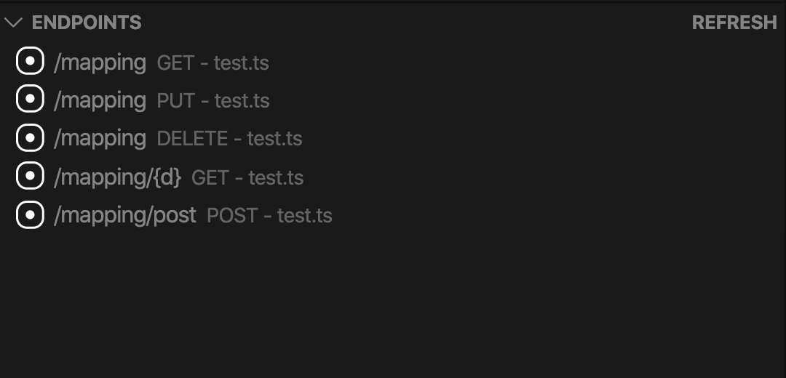

# Endpoints 

*Endpoints* is a Visual Studio Code extension to view and jump to any endpoint declared in the current project.

It will add a view in the side bar where all endpoints can be seen. Clicking on an endpoint will cause a jump to the file and line that declares the endpoint. With the "REFRESH" button the view can be updated.

Currently supported languages and frameworks: 
* Java (Spring Boot)
* Javascript / Typescript (using express)
* Python (Flask)
* PHP (Laravel)

It can be insatlled through the Marketplace: [https://marketplace.visualstudio.com/items?itemName=JonaNeumeier.endpoints](https://marketplace.visualstudio.com/items?itemName=JonaNeumeier.endpoints)

## Extension Settings

This extension contributes the following settings:

* `endpoints.files.include`: Glob pattern that is used to search all the files in the workspace.  
Default: `**/*.{java,php,ts,js,py}`
* `endpoints.files.include`: Glob pattern that are excluded when searching the files in the workspace.  
Default: `**/{test,node_modules}/{,**/}*.{java,php,ts,js,py}`
* `endpoints.express.appName`: The variable name used for the express app. Multiple values should be separated by |.  
Default: `app|route|router`

## Contribute
If you find any bugs or missing any features get in touch or directly open a PR.

## License
MIT. See license file.